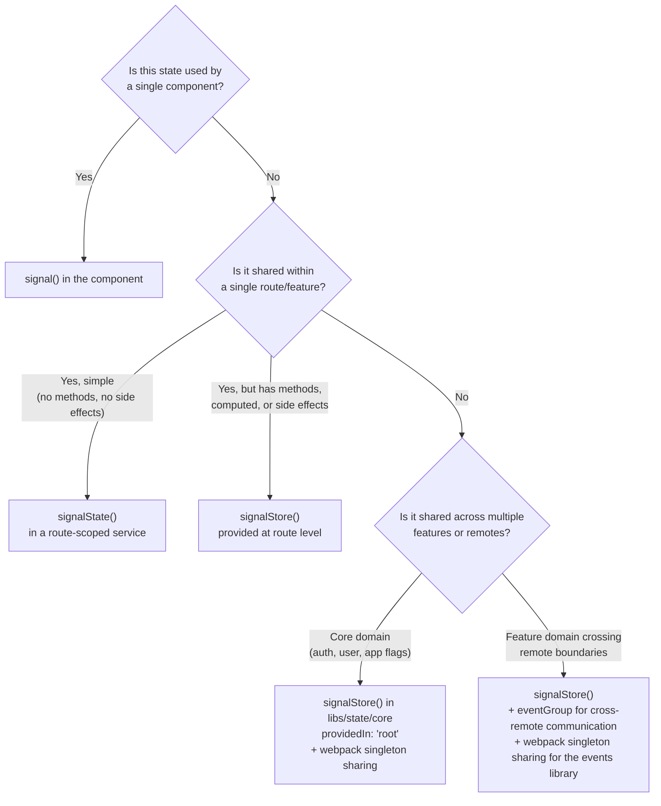

# Chapter 1: Architecture Thinking

> Before writing a single store, decide whether you need one at all.

This chapter builds the mental model you need before touching NgRx Signal Store. It covers when state management is worth the cost, how the spectrum of Angular reactivity primitives maps to real problems, and how Module Federation changes the rules.

---

## 1.1 When You Need State Management (and When You Don't)

State management libraries solve coordination problems. If no coordination problem exists, a library adds complexity without benefit. The first question is always: "Does more than one part of my application need this data, and will it change over time?"

Consider these scenarios:

| Scenario                                                                        | State Tool                                   | Why                                                                                                                       |
| ------------------------------------------------------------------------------- | -------------------------------------------- | ------------------------------------------------------------------------------------------------------------------------- |
| A toggle controlling a dropdown                                                 | Local `signal()` in the component            | Lifetime matches the component. No sharing needed.                                                                        |
| A search query shared between a search bar and a results list in the same route | `signalState()` in a route-level service     | Two components need the same reactive value, but no persistence or side effects are involved.                             |
| Auth tokens consumed by an HTTP interceptor, a nav bar, and multiple routes     | `signalStore()` with `providedIn: 'root'`    | Multiple consumers across the application, async side effects (login HTTP call), derived state (`isAuthenticated`).       |
| A cart shared across independently deployed micro frontends                     | `signalStore()` + webpack singleton + events | The store must survive independently compiled bundles. Events decouple producers from consumers across remote boundaries. |

The cost of state management is indirection. Every store you create is a layer between the component that triggers a change and the component that renders it. That layer is justified when:

1. **Multiple consumers** need the same data.
2. **Side effects** (HTTP, WebSocket, localStorage) must be coordinated.
3. **Derived state** would be duplicated without centralization.
4. **Lifetime** of the data exceeds the lifetime of any single component.

If none of these apply, a plain `signal()` in the component is the right answer.

Sources: [Angular State Management for 2025 | Nx Blog](https://nx.dev/blog/angular-state-management-2025), [The NGRX Signal Store and Your Architecture](https://www.angulararchitects.io/blog/the-ngrx-signal-store-and-your-architecture/)

---

## 1.2 The State Management Spectrum

Angular provides a spectrum of reactive primitives, each adding a layer of structure. The key is choosing the lightest tool that solves the problem.

### Level 0: Plain `signal()`

```typescript
import { signal, computed } from '@angular/core';

// Inside a component
readonly isOpen = signal(false);
readonly label = computed(() => this.isOpen() ? 'Close' : 'Open');

toggle(): void {
  this.isOpen.update(v => !v);
}
```

**Use when:** State belongs to one component. No sharing, no side effects, no persistence.

### Level 1: `signalState()`

```typescript
import { signalState, patchState } from '@ngrx/signals';

// Inside a service or component
readonly state = signalState({
  query: '',
  page: 1,
  pageSize: 20,
});

search(query: string): void {
  patchState(this.state, { query, page: 1 });
}
```

`signalState()` creates a reactive container with deep signals for each property. It is a standalone function, not an Angular service. It does not support `withComputed`, `withMethods`, or lifecycle hooks. Think of it as a structured alternative to a bag of individual signals.

**Use when:** You need a structured reactive container for a component or service, but the full ceremony of a store (methods, computed, hooks) is unnecessary.

_Verified from installed package type definitions: `signalState` is exported from `@ngrx/signals` and returns `DeepSignal<State> & WritableStateSource<State>`._

### Level 2: `signalStore()`

```typescript
import { signalStore, withState, withComputed, withMethods } from '@ngrx/signals';
import { withDevtools, withCallState } from '@angular-architects/ngrx-toolkit';

export const ProductsStore = signalStore(
  { providedIn: 'root' },
  withDevtools('products'),
  withState({ products: [] as Product[], selectedId: null as number | null }),
  withCallState(),
  withComputed((store) => ({
    selectedProduct: computed(() => store.products().find((p) => p.id === store.selectedId())),
  })),
  withMethods((store) => {
    const http = inject(HttpClient);
    return {
      loadProducts: rxMethod<void>(/* ... */),
    };
  }),
);
```

`signalStore()` generates an injectable Angular service class. It supports composition through features (`withState`, `withComputed`, `withMethods`, `withHooks`, `withProps`), and its lifetime is controlled by Angular's dependency injection.

**Use when:** State has a public API (methods), derived values (computed), side effects (rxMethod), or needs DI-scoped lifetime.

_Verified from installed package type definitions: `signalStore` is exported from `@ngrx/signals` and accepts up to 15 features._

### Level 3: `signalStore()` + Events

```typescript
import { type } from '@ngrx/signals';
import { eventGroup } from '@ngrx/signals/events';

export const cartEvents = eventGroup({
  source: 'Cart',
  events: {
    addToCart: type<CartProduct>(),
    removeFromCart: type<{ id: number }>(),
    clearCart: type<void>(),
  },
});
```

Events decouple producers from consumers. A component dispatches `cartEvents.addToCart(product)` without knowing which store handles it. The store uses `withEventHandlers` to react.

**Use when:** Multiple stores or remotes need to react to the same action, or you want to decouple "what happened" from "what should change."

_Verified from installed package type definitions: `eventGroup` and `type` are exported from `@ngrx/signals/events` and `@ngrx/signals` respectively._

### Spectrum Summary

| Level | Primitive                | DI Service? | Computed            | Methods           | Side Effects        | Events | Use When                |
| ----- | ------------------------ | ----------- | ------------------- | ----------------- | ------------------- | ------ | ----------------------- |
| 0     | `signal()`               | No          | `computed()`        | Component methods | Manual              | No     | Single component        |
| 1     | `signalState()`          | No          | Manual `computed()` | Manual            | Manual              | No     | Structured local state  |
| 2     | `signalStore()`          | Yes         | `withComputed`      | `withMethods`     | `rxMethod`          | No     | Shared service state    |
| 3     | `signalStore()` + events | Yes         | `withComputed`      | `withMethods`     | `withEventHandlers` | Yes    | Cross-domain decoupling |

Sources: [NgRx Signal Store Official Docs](https://ngrx.io/guide/signals/signal-store), [Benefits of using NgRx Signal State/Store over Signals](https://medium.com/multitude-it-labs/ngrx-signal-store-vs-signal-state-vs-simple-signal-33ceb2f5ee1d)

---

## 1.3 Classic NgRx vs Signal Store: Concept Mapping

If you have experience with classic NgRx (`@ngrx/store`), this table maps the old concepts to their Signal Store equivalents.

| Classic NgRx               | Signal Store                                         | Notes                                                                                 |
| -------------------------- | ---------------------------------------------------- | ------------------------------------------------------------------------------------- |
| `createAction()`           | `withMethods` (or `eventGroup` for decoupled events) | Methods are the default. Use events only when decoupling is needed.                   |
| `createReducer()`          | `patchState()` / `updateState()` inside methods      | `updateState()` from ngrx-toolkit adds DevTools action labels.                        |
| `createSelector()`         | `withComputed()`                                     | Returns Angular `computed()` signals instead of memoized selectors.                   |
| `createEffect()`           | `rxMethod()` / `withEventHandlers()`                 | `rxMethod` for direct RxJS pipelines, `withEventHandlers` for event-driven reactions. |
| `StoreModule.forRoot()`    | `signalStore({ providedIn: 'root' })`                | No module registration needed.                                                        |
| `StoreModule.forFeature()` | Route-level `providers: [FeatureStore]`              | Scoped to the route's injector.                                                       |
| Feature state slice        | Individual `signalStore()`                           | One store per bounded context, not one global store with slices.                      |

The fundamental shift: classic NgRx is a single global store with feature slices. Signal Store is many independent stores, each an Angular service. This maps naturally to Domain-Driven Design where each bounded context owns its state.

Sources: [NgRx: From the Classic Store to the Signal Store](https://medium.com/@fabio.cabi/ngrx-from-the-classic-store-to-the-signal-store-what-changes-for-angular-developers-816c8d05f18d)

---

## 1.4 Domain-Driven Design Concepts for Frontend State

DDD's strategic design gives us a vocabulary for organizing state in a monorepo with micro frontends.

### Bounded Contexts

A **bounded context** is a boundary within which a particular domain model is consistent. In this workspace:

- **Auth context** (`libs/state/core`): Tokens, authentication status, login/logout lifecycle.
- **User context** (`libs/state/core`): User profile, display name, preferences.
- **Products context** (`libs/feature/products/state`): Product catalog, search, filtering.
- **Orders context** (`libs/feature/orders/state`): Order history, order details.
- **Cart context** (`libs/feature/cart/state`): Cart items, quantities, totals.

Each bounded context gets its own store. Stores do not share internal state structures. When one context needs data from another, it uses one of two patterns:

1. **Direct injection:** The consuming store injects the producing store and reads its public signals. This creates a compile-time dependency. Use within the same deployment unit.

2. **Events:** The producing context dispatches events. The consuming context handles them via `withEventHandlers`. This avoids compile-time coupling. Use across Module Federation remotes.

### Core Domain vs Feature Domain

Not all contexts are equal:

| Domain Type      | Example               | Shared?                        | Deployment     | Store Location            |
| ---------------- | --------------------- | ------------------------------ | -------------- | ------------------------- |
| Core             | Auth, User, App Flags | Yes, via MF singleton          | Shell          | `libs/state/core`         |
| Feature          | Products, Orders      | No, isolated per remote        | Per remote     | `libs/feature/*/state`    |
| Feature (shared) | Cart                  | Yes, via MF singleton + events | Shell (shared) | `libs/feature/cart/state` |

Core domain state lives in the shell and is shared at runtime through webpack's singleton mechanism. Feature domain state is scoped to the remote that owns it and is never shared.

The Cart is an interesting exception: it is a feature domain, but it must be accessible from multiple remotes (the product listing remote dispatches `addToCart`, and the cart remote displays items). This is why `CartStore` uses `providedIn: 'root'` and is included in the webpack shared singletons, and why it communicates through events rather than direct injection.

### The Public API Boundary

Each library exposes state through its `index.ts` barrel file. This barrel is the bounded context's public API. Internal implementation details (services, models, helper functions) stay behind the barrel. External consumers see only the store class and exported types.

```
libs/state/core/src/index.ts
  ├── AuthStore    (re-exported)
  ├── UserStore    (re-exported)
  ├── AppStore     (re-exported)
  ├── cartEvents   (re-exported)
  └── models       (re-exported types)
```

This ensures that when you change an internal implementation detail (rename a private method, restructure internal services), no consumers break.

Sources: [DDD in Angular & Frontend Architecture](https://www.angulararchitects.io/blog/all-about-ddd-for-frontend-architectures-with-angular-co/), [Sustainable Angular Architectures with Strategic Design (DDD)](https://www.angulararchitects.io/blog/sustainable-angular-architectures-1/), [You're misunderstanding DDD in Angular (and Frontend)](https://www.angularspace.com/youre-misunderstanding-ddd-in-angular-and-frontend/)

---

## 1.5 How Module Federation Changes the Equation

In a traditional single-build Angular application, `providedIn: 'root'` guarantees a singleton. The entire application shares one root injector.

Module Federation breaks this guarantee. Each remote is compiled independently, with its own copy of every dependency. Without explicit configuration, a store marked `providedIn: 'root'` will have a separate instance in the shell and in each remote. The AuthStore in the shell knows the user is logged in; the AuthStore in the orders remote does not.

### The Singleton Solution

Webpack Module Federation's `shared` configuration solves this by deduplicating packages at runtime:

```typescript
// tools/mf-shared.ts
export const SHARED_SINGLETONS = ['@angular/core', '@angular/common', '@angular/common/http', '@angular/router', '@angular/forms', '@angular/platform-browser', '@ngrx/signals', '@angular-architects/ngrx-toolkit', '@org/state-core', 'rxjs'] as const;
```

When `@angular/core` is marked as `singleton: true`, all remotes use the shell's copy of Angular. This means one root injector, one `AuthStore` instance, one set of signals.

### What This Means for Architecture

1. **Core stores must be in the shared list.** `@org/state-core` is shared as a singleton. Any store in this library is automatically a singleton across all remotes.

2. **Feature stores must NOT be in the shared list.** `@org/feature-products-state` is not shared. Each remote gets its own instance, scoped to its own injector. This is correct: the products remote owns its product state, and no other remote should access it directly.

3. **Cross-remote communication uses events, not direct injection.** Even though `@org/state-core` is shared, a feature store in a remote should not directly inject another remote's feature store. That would create a runtime dependency on a package that might not be loaded. Events flow through the shared `@org/state-core` library, which is always available.

Chapter 3 covers the mechanics in detail.

Sources: [Micro Frontend Architecture | Nx](https://nx.dev/more-concepts/micro-frontend-architecture), [Module Federation Singleton Sharing](https://github.com/angular-architects/module-federation-plugin/issues/11)

---

## 1.6 Decision Framework

Use this flowchart when deciding how to manage a piece of state:



### Quick Reference Table

| Question                            | Answer | Tool                               |
| ----------------------------------- | ------ | ---------------------------------- |
| One component uses it               | Yes    | `signal()`                         |
| Structured local state, no methods  | Yes    | `signalState()`                    |
| Needs methods, computed, or DI      | Yes    | `signalStore()`                    |
| Shared across the app or MF remotes | Yes    | `signalStore()` + singleton config |
| Cross-remote decoupling needed      | Yes    | `signalStore()` + `eventGroup`     |

---

## 1.7 Common Mistakes

### Mistake 1: Over-centralizing State

**Symptom:** Every piece of UI state (form dirty flags, accordion open/close, tab selection) is put into a global store.

**Problem:** This creates unnecessary dependencies, bloats the store, and makes components harder to reuse.

**Fix:** If the state's lifetime matches a component, it belongs in a `signal()` on that component. Stores are for state that outlives components or is shared between them.

### Mistake 2: Skipping Singleton Configuration in Module Federation

**Symptom:** Auth works in the shell but the user appears logged out in remotes. DevTools shows duplicate store instances.

**Problem:** Without `singleton: true` in the webpack shared config, each remote gets its own copy of `@ngrx/signals`, creating separate injector trees with separate store instances.

**Fix:** Ensure all packages in `SHARED_SINGLETONS` (see `tools/mf-shared.ts`) are marked as singletons. This includes `@angular/core`, `@ngrx/signals`, and `@org/state-core`.

### Mistake 3: Feature Stores Injecting Each Other Across Remotes

**Symptom:** The orders remote imports from `@org/feature-products-state`. Builds start failing when the products team changes their store.

**Problem:** This creates compile-time coupling between independently deployed remotes. It violates bounded context boundaries and defeats the purpose of Module Federation.

**Fix:** If two remotes need to coordinate, define events in `libs/state/core` (which is shared) and handle them with `withEventHandlers`. The producing remote dispatches; the consuming remote reacts.

### Mistake 4: Using Events Before You Need Them

**Symptom:** Every store communicates through events, even stores in the same library that could simply inject each other.

**Problem:** Events add indirection. Tracing "what happens when the user logs in" requires searching for event handlers instead of following a direct method call. This indirection is the price you pay for decoupling. Pay it only when decoupling is needed.

**Fix:** Default to direct injection for stores within the same deployment unit (same remote or shell). Introduce events only when stores in different remotes need to react to the same action, or when you explicitly want to decouple a producer from its consumers.

### Mistake 5: Storing Server-Owned Data in Client State

**Symptom:** A store caches the full product catalog and tries to keep it in sync with the server through polling or WebSocket.

**Problem:** The client becomes a stale cache of the server. Cache invalidation bugs multiply with each new feature.

**Fix:** Stores should hold data the client needs right now: the current page of products, the active filter, the selected item. Treat the server as the source of truth and fetch when needed. Use `withCallState()` to track loading/error states instead of trying to maintain a synchronized replica.

Sources: [Best Practices for Angular State Management](https://dev.to/devin-rosario/best-practices-for-angular-state-management-2pm1), [The NGRX Signal Store and Your Architecture](https://www.angulararchitects.io/blog/the-ngrx-signal-store-and-your-architecture/)

---

## Summary

- **Start simple.** Reach for `signal()` first. Move to `signalState()` when you need structure, `signalStore()` when you need DI and a public API, and events when you need cross-domain decoupling.
- **Respect bounded contexts.** Each domain gets its own store. Core domains are shared via MF singletons. Feature domains are isolated.
- **Module Federation changes the rules.** `providedIn: 'root'` is necessary but not sufficient. The webpack singleton config makes it work.
- **Pay for indirection only when it buys you something.** Direct injection is simpler than events. Events are simpler than a message bus. Choose the lightest tool that solves the coordination problem.

Next: [Chapter 2: Nx Workspace Design](./02-nx-workspace-design.md) covers how the library structure enforces these boundaries at build time.
